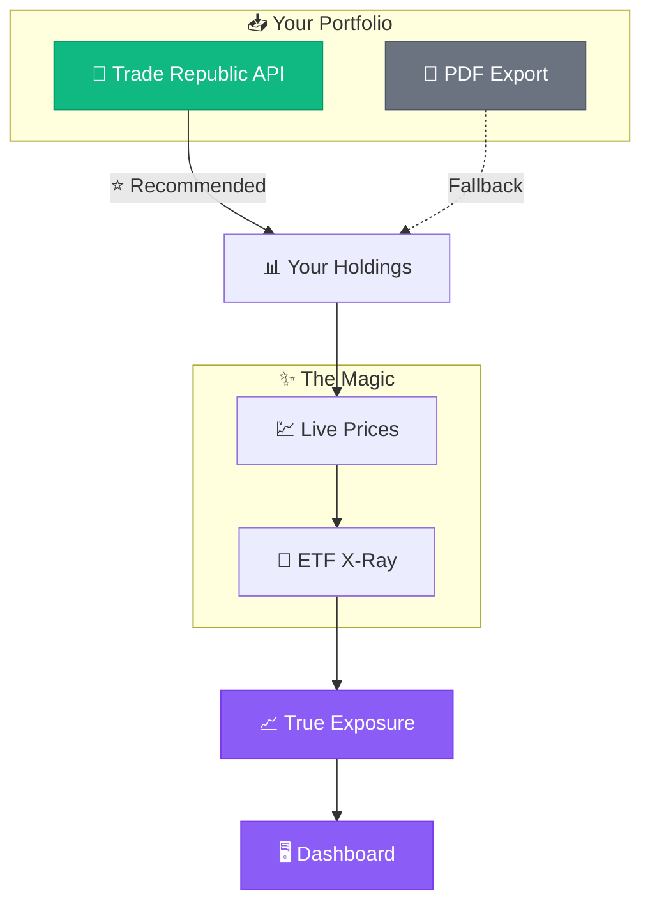
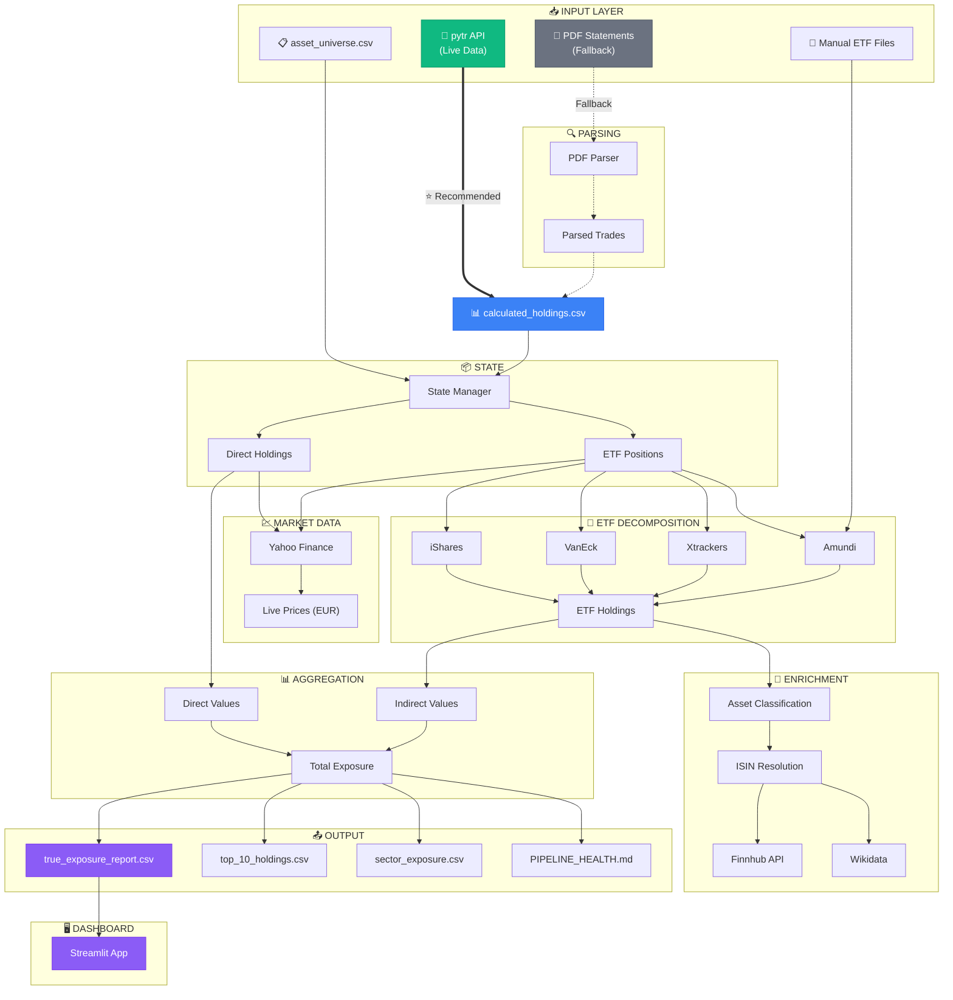

# Portfolio Prism

> **"Stop looking at the wrapper. Start looking at the ingredients."**

You own ETFs. But what do you *actually* own? This tool breaks apart your ETF wrappers and shows your true exposure to individual stocks across your entire portfolio.

---

---

## 🚀 5-Minute Quickstart

### 1. Prerequisites
- Python 3.9+
- Git

### 2. Clone & Install
```bash
git clone https://github.com/Skeptomenos/Portfolio-Prism.git
cd Portfolio-Prism/POC

# Create virtual environment
python3 -m venv venv
source venv/bin/activate

# Install dependencies
pip install -e .
```

### 3. Get Your API Key (Free)
1. Go to [finnhub.io/register](https://finnhub.io/register)
2. Create a free account
3. Copy your API key from the dashboard

### 4. Create Environment File
```bash
cp .env.example .env
```

Edit `.env` and add your Finnhub API key:
```
FINNHUB_API_KEY=your_api_key_here
```

### 5. Run the Pipeline
```bash
bash run.sh
```

You'll see an interactive menu:

```
========================================
  Portfolio Prism - True Exposure Tool
========================================

How would you like to fetch your portfolio?

  [1] Trade Republic API (recommended)
      Fetches live data directly from your TR account

  [2] PDF Export
      Uses downloaded 'Kontoauszug' PDFs

Select option [1/2] (default: 1): 
```

#### Option 1: Trade Republic API (Recommended)

The tool uses [pytr](https://github.com/pytr-org/pytr) to fetch your portfolio directly:

1. **First run:** Enter your Trade Republic phone number and PIN (stored locally in `.env`)
2. **Verification:** Enter the 4-digit code from your TR app
3. **Done!** Your portfolio is fetched and analyzed automatically

> **Privacy:** Your credentials are stored locally in `.env` (gitignored) and never uploaded anywhere.

#### Option 2: PDF Export (Alternative)

If API access fails, you can use PDF exports:

1. Open **Trade Republic** app
2. Go to **Profile → Activity → Account Statement** ("Kontoauszug")
3. Download the PDF and place it in `data/inputs/portfolio/`
4. Run `bash run.sh` and select option 2

### What Happens Next

The pipeline will:
1. **Fetch/Parse holdings** - Get your current positions
2. **Fetch live prices** - Get current EUR prices from Yahoo Finance
3. **Decompose ETFs** - Download underlying holdings from iShares, VanEck, Xtrackers, Amundi
4. **Calculate true exposure** - Aggregate your real exposure to each stock
5. **Generate reports** - Save results to `outputs/`

### 6. View the Dashboard
```bash
./run_dashboard.sh
```

Open [http://localhost:8501](http://localhost:8501) in your browser.

---

## 📊 Dashboard Features

The interactive Streamlit dashboard shows:

- **Portfolio Overview** - Total value, asset allocation pie charts
- **True Exposure** - Your real holdings after ETF decomposition
- **Top Holdings** - Your biggest positions (including hidden ETF exposure)
- **Stock Lookup** - Search any stock to see your total exposure
- **Sector & Geography** - Where your money is actually invested

---

## 🔎 Why This Tool Exists

**The Problem:** Brokerage apps show you the ETF wrapper, not the contents. You might think you're diversified, but you could be 20% exposed to Nvidia across 5 different funds without knowing it.

**The Solution:** Portfolio Prism tears apart your ETFs and rebuilds your portfolio from the bottom up. It tells you what you *actually* own.

### Example

| What Your Broker Shows | What You Actually Own |
|------------------------|----------------------|
| MSCI World ETF: €10,000 | Apple: €420 |
| S&P 500 IT ETF: €5,000 | Microsoft: €380 |
| NASDAQ 100 ETF: €3,000 | Nvidia: €650 |
| Nvidia Stock: €500 | ... |
| **Total Nvidia: €500** | **Total Nvidia: €1,150** |

---

## 🔧 Configuration

### API Keys

| Key | Required | Purpose | Get it at |
|-----|----------|---------|-----------|
| `FINNHUB_API_KEY` | Yes* | ISIN resolution, company data | [finnhub.io](https://finnhub.io/register) |
| `OPENFIGI_API_KEY` | No | Alternative ISIN lookup | [openfigi.com](https://www.openfigi.com/api) |

*The system can work without API keys using cached data, but resolution of new securities will be limited.

### Amundi ETFs (Manual Setup)

Amundi doesn't provide easy API access. If you own Amundi ETFs:

1. Go to [amundi.com](https://www.amundi.com)
2. Find your ETF and download the "Zusammensetzung" (Holdings) XLSX
3. Save it as `data/inputs/manual_holdings/{ISIN}.xlsx`

Example: `data/inputs/manual_holdings/FR0010361683.xlsx`

### First Run Behavior

On first run, the system may pause to ask questions:
- **"Select provider for ETF..."** - Choose iShares, Amundi, etc.
- **"Enter Yahoo ticker for..."** - Provide the ticker or press Enter to skip

Your answers are saved for future runs.

---

## 📂 Project Structure

```
data/
├── inputs/
│   ├── portfolio/          # Your Trade Republic PDF statements go here
│   └── manual_holdings/    # Amundi XLSX files (if you own Amundi ETFs)
└── working/
    └── calculated_holdings.csv  # AUTO-GENERATED: Your current positions

config/
├── asset_universe.csv      # ISIN ↔ Ticker mappings (auto-populated)
├── adapter_registry.json   # ETF → Provider mapping
└── ticker_map.json         # Yahoo ticker cache

outputs/
├── true_exposure_report.csv    # Full look-through exposure
├── top_10_holdings.csv         # Your biggest positions
├── sector_exposure.csv         # Sector breakdown
└── PORTFOLIO_SUMMARY.md        # Visual dashboard
```

---

## 🏗 How It Works



### Pipeline Stages

| Stage | What Happens |
|-------|--------------|
| **1. Fetch Portfolio** | Get holdings via Trade Republic API (recommended) or parse PDF exports (fallback) |
| **2. Calculate Holdings** | Sum quantities per ISIN to get current positions |
| **3. Fetch Prices** | Get live EUR prices from Yahoo Finance |
| **4. Identify ETFs** | Separate stocks from ETFs |
| **5. Decompose ETFs** | Fetch underlying holdings from each provider |
| **6. Resolve ISINs** | Match holdings to securities database |
| **7. Aggregate** | Sum direct + indirect exposure per stock |
| **8. Enrich** | Add sector, geography, company info |
| **9. Validate** | Check value conservation (±2% tolerance) |
| **10. Report** | Generate CSV reports and dashboard |

---

## 🔧 Troubleshooting

### Common Issues

| Problem | Solution |
|---------|----------|
| `command not found` | Run `source venv/bin/activate` |
| `FINNHUB_API_KEY not set` | Create `.env` file with your API key |
| `pytr not found` | Run `pip install pytr` |
| `pytr authentication failed` | Run `python scripts/fetch_tr_api.py --reconfigure` to update credentials |
| `No trades found in PDF` | Make sure it's the "Kontoauszug" (Account Statement), not a monthly securities report |
| `Wrong quantities` | Delete `calculated_holdings.csv` and re-run to reprocess all PDFs |
| `No price for ISIN` | Check if ticker exists on Yahoo Finance |
| `Amundi download failed` | Use manual XLSX file (see Configuration) |
| Dashboard won't start | Check port 8501 is free, or use `--server.port 8502` |

### Reset Everything
```bash
rm -rf data/working/cache/*
rm data/working/calculated_holdings.csv
bash run.sh
```

---

## 🧪 Development

```bash
# Run tests
pytest

# Lint code
ruff check .

# Format code
ruff format .
```

---

## 🏗 Detailed Architecture

<details>
<summary>Click to expand full architecture diagram</summary>



</details>

### Key Design Patterns

| Pattern | Description |
|---------|-------------|
| **Hybrid Data Sourcing** | API → Direct Download → Manual fallback |
| **Tiered Resolution** | Full enrichment for holdings >1%, lightweight for rest |
| **Self-Learning Cache** | Successful resolutions auto-saved for future runs |
| **Value Conservation** | ±2% tolerance check ensures no value is lost in decomposition |

---

## 📜 License

MIT

---

## 🤖 Built with AI

This project was developed using [Anamnesis](https://github.com/Skeptomenos/Anamnesis), an AI engineering framework for structured development workflows.
