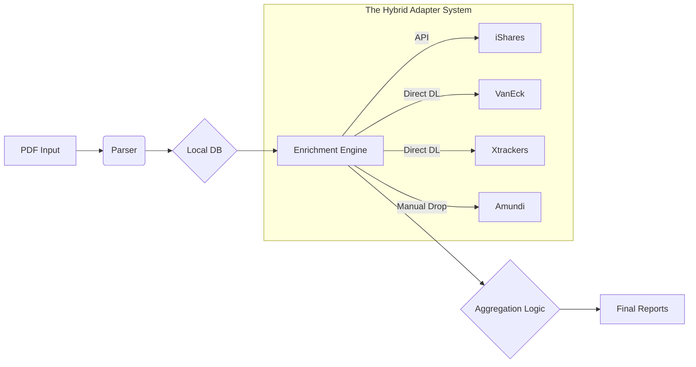

# True Exposure Portfolio Analyzer

> **"Stop looking at the wrapper. Start looking at the ingredients."**

## 🔎 Why This Tool Exists

Modern portfolios are built on ETFs. You might own "Core MSCI World," but what you *really* own is 4% Apple, 3% Microsoft, and 1,300 other tiny fragments.

For most investors, this exposure is a black box.
*   **The Problem:** Brokerage apps (like Trade Republic) only show you the ETF wrapper. You have no idea if you are accidentally overweight in Nvidia across 3 different funds, or if your "Global" portfolio is actually 70% US Tech.
*   **The Solution:** The **True Exposure Portfolio Analyzer** parses your actual broker statements, tears apart the ETF wrappers, and rebuilds your portfolio from the bottom up. It tells you what you *actually* own.

## ⚡ Capabilities

*   **PDF Parsing:** Automatically ingests Trade Republic "Kontoauszug" PDFs to reconstruct your transaction history.
*   **Look-Through Analysis:** Decomposes ETFs into their underlying holdings (Stocks) using provider-specific data adapters.
*   **Hybrid Data Sourcing:** Fetches data via APIs (iShares), Direct Downloads (VanEck, Xtrackers), or Manual File Drops (Amundi).
*   **Live Pricing:** Uses `yfinance` to get real-time market values for 50,000+ global assets.
*   **Automated Reports:** Generates:
    *   `true_exposure_report.csv`: Every single underlying asset you own.
    *   `top_10_holdings.csv`: Your biggest real bets.
    *   `sector_exposure.csv`: Your actual diversification.

## 🏗 Architecture & Design

The project is built as a linear pipeline to ensure auditability and data integrity:



### Engineering Challenges & Solutions

#### 1. The "Free Data" Fallacy
**Challenge:** High-quality ETF holdings data is expensive. Free APIs are non-existent or severely rate-limited.
**Solution:** We reverse-engineered the "Direct Download" links used by institutional investors on provider websites. This allows us to get authoritative data without scraping brittle UIs.

#### 2. The Amundi "Escape Hatch"
**Challenge:** Amundi's website uses complex anti-bot protections and JavaScript-blob downloads that defeated standard Selenium automation.
**Solution:** Instead of fighting the website, we built a "Manual Escape Hatch". The system detects if it can't download an Amundi file and pauses to ask the user to drop the file into `data/inputs/manual_holdings/`. This prioritizes system stability over 100% automation.

#### 3. Value Conservation Check
**Challenge:** When you break apart an ETF, you risk losing value in the math (e.g., tracking errors, cash drag, unclassified assets).
**Solution:** We implemented a strict **Value Conservation Check**. The pipeline calculates your portfolio value *before* and *after* the look-through. If the difference is >2%, the pipeline halts and alerts you. **We don't guess with your money.**

## 🚀 Installation & Setup

### 1. Prerequisites
*   Python 3.9+
*   `pip`

### 2. Installation
```bash
# Clone the repository
git clone https://github.com/yourusername/portfolio-master.git
cd portfolio-master/POC

# Create and activate virtual environment
python3 -m venv venv
source venv/bin/activate

# Install the package in editable mode
pip install -e .
```

### 3. Prepare Your Data
1.  **Download your PDFs:** Go to Trade Republic -> Profile -> Activity -> Account Statement ("Kontoauszug").
2.  **Place them:** Move the PDFs to:
    ```
    data/inputs/portfolio/
    ```

## 🏃 Usage Guide

### Step 1: Run the Pipeline
The `run.sh` script handles everything (Parsing -> Database -> Aggregation -> Reporting).

```bash
bash run.sh
```

### Step 2: Handling Amundi ETFs (The Escape Hatch)
If you own Amundi ETFs, the script may ask you for help:
1.  It will log: `⚠️ Amundi download failed. Please provide manual file.`
2.  Go to the Amundi website, download the **Holdings XLSX** for your ETF.
3.  Rename it to match the ISIN (e.g., `FR0010361683.xlsx`).
4.  Place it in `data/inputs/manual_holdings/`.
5.  Run `bash run.sh` again. The system will find the file and proceed.

### Step 3: View Your Reports
All results are generated in the `outputs/` directory:
*   **`true_exposure_report.csv`**: The master list. Open this in Excel.
*   **`sector_exposure.csv`**: See where your risks are concentrated.
*   **`top_10_holdings.csv`**: Your actual biggest positions.

## 🔧 Troubleshooting

### Common Issues
*   **"Command not found"**: Ensure you ran `source venv/bin/activate`.
*   **"No trades found"**: Check that your PDF is the "Kontoauszug" (Account Statement), not a monthly securities statement.
*   **"Value Conservation Failed"**:
    *   Did an ETF fail to download? Check `outputs/logs`.
    *   Do you have assets in USD? The tool currently standardizes on EUR.

### Data Reset
If you want to start fresh (e.g., after adding new PDFs):
```bash
# Clear the database and cache
rm data/working/database/portfolio.db
rm -rf data/working/cache/*
bash run.sh
```

## 📂 Project Structure
```text
data/
├── inputs/
│   ├── portfolio/          # Your PDFs go here
│   └── manual_holdings/    # Manual Amundi files go here
└── working/                # System DB and caches (Do not touch)
scripts/                    # Entry points (run_pipeline.py, setup_db.py)
src/
├── adapters/               # ETF Provider logic
├── core/                   # Aggregation & Reporting logic
├── data/                   # I/O & Enrichment (enrichment.py)
├── pdf_parser/             # Trade Republic parser
└── utils/                  # Shared utilities
outputs/                    # Your final reports
```
