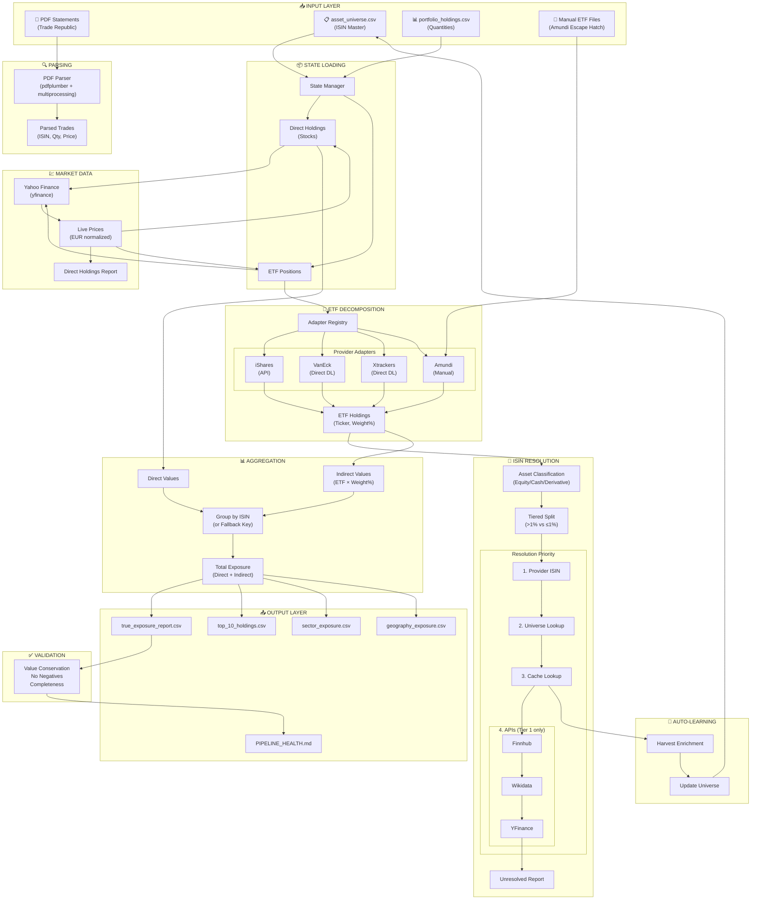

# True Exposure Portfolio Analyzer

> **"Stop looking at the wrapper. Start looking at the ingredients."**

## 🔎 Why This Tool Exists

Modern portfolios are built on ETFs. You might own "Core MSCI World," but what you *really* own is 4% Apple, 3% Microsoft, and 1,300 other tiny fragments.

For most investors, this exposure is a black box.
*   **The Problem:** Brokerage apps (like Trade Republic) only show you the ETF wrapper. You have no idea if you are accidentally overweight in Nvidia across 3 different funds, or if your "Global" portfolio is actually 70% US Tech.
*   **The Solution:** The **True Exposure Portfolio Analyzer** parses your actual broker statements, tears apart the ETF wrappers, and rebuilds your portfolio from the bottom up. It tells you what you *actually* own.

## ⚡ Capabilities

*   **PDF Parsing:** Automatically ingests Trade Republic "Kontoauszug" PDFs to reconstruct your transaction history.
*   **Look-Through Analysis:** Decomposes ETFs into their underlying holdings (Stocks) using provider-specific data adapters.
*   **Hybrid Data Sourcing:** Fetches data via APIs (iShares), Direct Downloads (VanEck, Xtrackers), or Manual File Drops (Amundi).
*   **Live Pricing:** Uses `yfinance` to get real-time market values for 50,000+ global assets.
*   **Asset Management CLI:** `scripts/manage_assets.py` provides add, list, search, validate, and remove commands for `asset_universe.csv` and auto‑syncs the ticker map.
*   **Automated Reports:** Generates:
    *   `true_exposure_report.csv`: Every single underlying asset you own.
    *   `top_10_holdings.csv`: Your biggest real bets.
    *   `sector_exposure.csv`: Your actual diversification.

## 🏗 Architecture & Data Flow

The pipeline transforms raw broker PDFs into a complete "look-through" view of your portfolio through 7 distinct stages:



### Pipeline Stages Explained

| Stage | Description | Key Files |
|-------|-------------|-----------|
| **1. Input** | PDF statements, asset universe, and portfolio holdings | `data/inputs/portfolio/*.pdf`, `config/asset_universe.csv` |
| **2. Parsing** | Extract transactions from German PDFs using multiprocessing | `src/pdf_parser/parser.py` |
| **3. State Loading** | Join universe + holdings, split into Stocks vs ETFs | `src/data/state_manager.py` |
| **4. Market Data** | Fetch live prices from Yahoo Finance, normalize to EUR | `src/data/market.py` |
| **5. ETF Decomposition** | Fetch underlying holdings via provider-specific adapters | `src/adapters/*.py` |
| **6. Resolution** | Resolve ISINs via Provider → Universe → Cache → APIs (Tier 1 only) | `src/data/resolution.py` |
| **7. Aggregation** | Sum direct + indirect exposure per security | `src/core/aggregation.py` |
| **8. Reporting** | Generate sector, geography, and top holdings reports | `src/core/reporting.py` |
| **9. Validation** | Value conservation check (±2% tolerance) | `src/core/validation.py` |
| **10. Auto-Learning** | Harvest resolved ISINs back to universe | `scripts/harvest_enrichment.py` |

### Engineering Challenges & Solutions

#### 1. The "Free Data" Fallacy
**Challenge:** High-quality ETF holdings data is expensive. Free APIs are non-existent or severely rate-limited.
**Solution:** We reverse-engineered the "Direct Download" links used by institutional investors on provider websites. This allows us to get authoritative data without scraping brittle UIs.

#### 2. The Amundi "Escape Hatch"
**Challenge:** Amundi's website uses complex anti-bot protections and JavaScript-blob downloads that defeated standard Selenium automation.
**Solution:** Instead of fighting the website, we built a "Manual Escape Hatch". The system detects if it can't download an Amundi file and pauses to ask the user to drop the file into `data/inputs/manual_holdings/`. This prioritizes system stability over 100% automation.

#### 3. Tiered Resolution
**Challenge:** Enriching 1,500+ holdings per ETF would exhaust API rate limits.
**Solution:** We implement **Tiered Resolution**: Only holdings >1% weight get full ISIN resolution via APIs (Tier 1). Minor holdings (≤1%) use deterministic `UNRESOLVED:{ticker}:{hash}` keys for aggregation (Tier 2). The ISIN column remains sacred—only valid ISINs or NULL, never composite keys. This reduces API calls by 90%+ while preserving 95%+ of portfolio value accuracy.

#### 4. Value Conservation Check
**Challenge:** When you break apart an ETF, you risk losing value in the math (e.g., tracking errors, cash drag, unclassified assets).
**Solution:** We implemented a strict **Value Conservation Check**. The pipeline calculates your portfolio value *before* and *after* the look-through. If the difference is >2%, the pipeline halts and alerts you. **We don't guess with your money.**

#### 5. Self-Learning System
**Challenge:** Repeatedly calling APIs for the same securities is wasteful and slow.
**Solution:** The **Harvesting** pattern: Successfully resolved ISINs are cached and automatically appended to `asset_universe.csv`. Future runs use local resolution, making them instant.

## 🚀 Installation & Setup

### 1. Prerequisites
*   Python 3.9+
*   `pip`

### 2. Installation
```bash
# Clone the repository
git clone https://github.com/yourusername/portfolio-master.git
cd portfolio-master/POC

# Create and activate virtual environment
python3 -m venv venv
source venv/bin/activate

# Install the package in editable mode
pip install -e .
```

### 3. Prepare Your Data
1.  **Download your PDFs:** Go to Trade Republic -> Profile -> Activity -> Account Statement ("Kontoauszug").
2.  **Place them:** Move the PDFs to:
    ```
    data/inputs/portfolio/
    ```

## 🏃 Usage Guide

### Step 1: Run the Pipeline
The `run.sh` script handles everything (Parsing -> Database -> Aggregation -> Reporting).

```bash
bash run.sh
```

### Step 2: Handling Amundi ETFs (The Escape Hatch)
If you own Amundi ETFs, the script may ask you for help:
1.  It will log: `⚠️ Amundi download failed. Please provide manual file.`
2.  Go to the Amundi website, download the **Holdings XLSX** for your ETF.
3.  Rename it to match the ISIN (e.g., `FR0010361683.xlsx`).
4.  Place it in `data/inputs/manual_holdings/`.
5.  Run `bash run.sh` again. The system will find the file and proceed.

### Step 3: View Your Reports
All results are generated in the `outputs/` directory:
*   **`true_exposure_report.csv`**: The master list. Open this in Excel.
*   **`sector_exposure.csv`**: See where your risks are concentrated.
*   **`top_10_holdings.csv`**: Your actual biggest positions.
*   **`PIPELINE_HEALTH.md`**: Quality metrics and actionable fixes.

## 🔧 Troubleshooting

### Common Issues
*   **"Command not found"**: Ensure you ran `source venv/bin/activate`.
*   **"No trades found"**: Check that your PDF is the "Kontoauszug" (Account Statement), not a monthly securities statement.
*   **"Value Conservation Failed"**:
    *   Did an ETF fail to download? Check `outputs/logs`.
    *   Do you have assets in USD? The tool currently standardizes on EUR.

### Data Reset
If you want to start fresh (e.g., after adding new PDFs):
```bash
# Clear the database and cache
rm data/working/database/portfolio.db
rm -rf data/working/cache/*
bash run.sh
```

## 📂 Project Structure
```text
data/
├── inputs/
│   ├── portfolio/          # Your PDFs go here
│   └── manual_holdings/    # Manual Amundi files go here
└── working/                # System DB and caches (Do not touch)
config/
├── asset_universe.csv      # ISIN ↔ Ticker master mapping
├── adapter_registry.json   # ETF → Provider mapping
└── ticker_map.json         # ISIN → Yahoo Ticker cache
scripts/                    # Entry points (run_pipeline.py, manage_assets.py)
src/
├── adapters/               # ETF Provider logic (iShares, VanEck, etc.)
├── core/                   # Aggregation, Reporting, Validation
├── data/                   # I/O, Resolution, Market Data, Caching
├── pdf_parser/             # Trade Republic PDF parser
└── utils/                  # Logging, ISIN Validation, Classification
outputs/                    # Your final reports
docs/
└── specs/                  # Living specifications (product, tech, requirements)
coding/                     # AI engineering framework (Anamnesis)
```

## 🧪 Development

```bash
# Run tests
pytest

# Lint code
ruff check .

# Format code
ruff format .
```

## 📊 Key Design Patterns

| Pattern | Description |
|---------|-------------|
| **Hybrid First** | Automation with manual fallback for brittle sources |
| **Tiered Resolution** | Prioritize high-value holdings (>1%) for API calls; minor holdings use `UNRESOLVED:` keys |
| **Sacred ISIN Column** | ISIN column only contains valid ISINs (Luhn-checked) or NULL, never composite keys |
| **Self-Learning Cache** | Auto-harvest successful resolutions to `asset_universe.csv` |
| **Value Conservation** | Audit trail with ±2% tolerance check |
| **Logic/IO Separation** | Pure aggregation logic in `core/`, I/O in `adapters/` and `data/` |

## 🤖 Built with AI

This project was developed using [Anamnesis](https://github.com/Skeptomenos/Anamnesis), an AI engineering framework that provides structured directives, thinking protocols, and coding standards for AI-assisted development. The framework's spec-driven workflow and state management patterns are implemented in the `coding/` directory.
