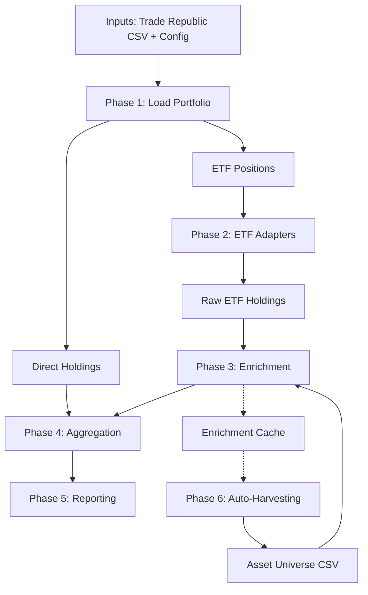

# System Flow & Architecture

This document outlines the end-to-end flow of the Portfolio Analysis Pipeline, detailing how data moves from raw inputs to final reports, including the self-learning enrichment mechanism.

## High-Level Overview

## Detailed Process Steps

### 1. Input & Loading
- **Source:** `data/inputs/` (Trade Republic export) and `config/etf_config.json`.
- **Action:** Parses the user's portfolio to identify:
  - **Direct Holdings:** Individual stocks (e.g., Nvidia, Apple).
  - **ETF Positions:** Funds that need decomposition (e.g., MSCI World).

### 2. ETF Decomposition (Adapters)
- **Action:** For each ETF, the appropriate adapter (iShares, Amundi, Xtrackers, etc.) fetches the *underlying holdings*.
- **Sources:**
  - **Web Scraping:** Downloads CSV/XLSX from provider websites.
  - **Manual Fallback:** Checks `data/inputs/manual_holdings/` if scraping fails.
- **Key Challenge:** Provider files often lack ISINs (e.g., iShares only provides Tickers).

### 3. Data Enrichment (The "Brain")
This is where the system resolves missing metadata (ISINs, Sectors, Geography).

**Resolution Priority:**
1.  **Local Universe (`asset_universe.csv`):**
    -   *Speed:* Instant.
    -   *Source:* User-verified data + Harvested data.
    -   *Priority:* Highest.
2.  **Wikidata API (Sophisticated Lookup):**
    -   *Speed:* ~2s per asset.
    -   *Logic:* Matches via Name + Raw Ticker + Yahoo Ticker.
    -   *Goal:* Find the official ISIN.
3.  **Finnhub / YFinance:**
    -   *Speed:* Variable.
    -   *Goal:* Fill gaps in Sector/Geography.

**Output:** Fully enriched holdings with valid ISINs.

### 4. Aggregation
- **Action:** Merges Direct Holdings with Enriched ETF Holdings.
- **Logic:**
  -   Groups by **ISIN** (Global Unique Identifier).
  -   Sums `Direct Value` + `Indirect Value` (from ETFs).
  -   Calculates total exposure weight.

### 5. Reporting
- **Output:** `outputs/true_exposure_report.csv`
- **Content:** A consolidated view of *actual* exposure.
  -   *Example:* You might own €100 of Apple directly, but €500 via ETFs. The report shows €600 total exposure.

### 6. Auto-Harvesting (Self-Learning)
- **Trigger:** Runs automatically at the end of the pipeline.
- **Action:** Scans the `Enrichment Cache` for successfully resolved ISINs that are *not* yet in `asset_universe.csv`.
- **Result:** Adds these new securities to `asset_universe.csv`.
- **Benefit:** The next time you run the pipeline, these assets are found locally (Step 1), skipping the slow API calls (Step 2/3). **The system gets faster and more robust with every run.**

## Key Files

-   `scripts/run_pipeline.py`: Main orchestrator.
-   `src/adapters/`: Provider-specific logic.
-   `src/data/enrichment.py`: ISIN resolution logic.
-   `config/asset_universe.csv`: The "Long-term Memory" of the system.
-   `outputs/true_exposure_report.csv`: The final truth.
